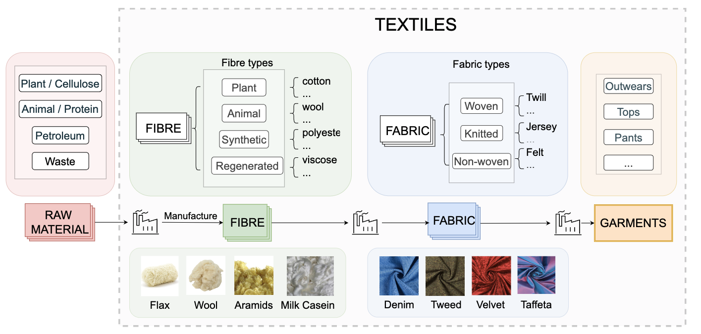

# 布匹织物分类数据集用MedViT模型跑分
### TextileNet

**特点**：
- **规模最大**：约 76 万张图片
- **类别丰富**：33 种纤维类型 + 27 种织物类型
- **用途广泛**：适合材料分类、织物纹理识别
- **基于材料分类学**：与材料领域专家合作设计，包含纤维和织物两个分类体系



**数据集下载**：
- **论文**：https://arxiv.org/abs/2301.06160
- **One Drive**：
  - TextileNet-fibre: [下载链接](https://smailuca-my.sharepoint.com/:f:/g/personal/ha_haspacedrive_onmicrosoft_com/EgbOa2lg45pMqWJSfmR5SOMBkB2j0gLK_YFXZueLi8rrKw?e=3YVB1C)
  - TextileNet-fabric: [下载链接](https://smailuca-my.sharepoint.com/:f:/g/personal/ha_haspacedrive_onmicrosoft_com/EgbOa2lg45pMqWJSfmR5SOMBkB2j0gLK_YFXZueLi8rrKw?e=3YVB1C)

**数据准备**：
下载后解压到 `data` 目录，结构如下：
```
project/
├── data/
│   ├── fibre/          # 33种纤维类型
│   │   ├── abaca/
│   │   ├── acrylic/
│   │   ├── alpaca/
│   │   └── ...
│   └── fabric/         # 27种织物类型
│       ├── canvas/
│       ├── chambray/
│       ├── chenille/
│       └── ...
```

**基准模型性能**：

| 数据集分区 | 网络模型 | 准确率 (Top-1/Top-5) |
|-----------|---------|-------------------|
| TextileNet-fibre | ResNet50 | 49.74±0.27% / 87.32±0.14% |
| TextileNet-fibre | ViT | 53.32±0.64% / 88.46±0.26% |
| TextileNet-fabric | ResNet50 | 65.28±0.67% / 90.36±0.31% |
| TextileNet-fabric | ViT | 67.32±0.45% / 92.12±0.26% |
## MedViT复现
fabric数据基于MedViT_base模型TOP1精度: 66.43% 

github： https://github.com/zhangs-cedar/MedViTV2


