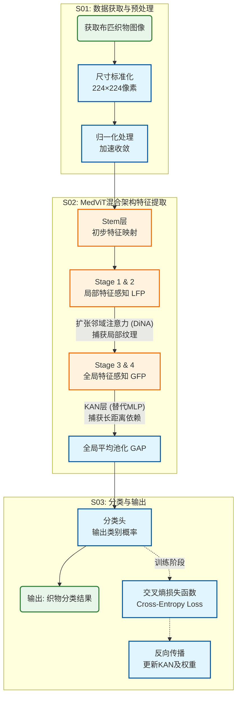

# 基于MedViT混合架构的布匹织物分类方法及应用改进

## 背景技术
传统的布匹织物分类主要依靠人工目视检查，存在效率低、主观性强、成本高等问题。工业实际卡控主要通过纹理粗糙度、经纬密度、颜色直方图等浅层特征来判定织物类别，但存在以下关键问题：1）浅层视觉特征难以与真实“材质属性”建立准确对应关系，泛化能力不足；2）缺乏标准化的细粒度特征评估机制，无法量化微观纤维形态、编织拓扑结构等决定分类精度的关键特征；3）现有方法无法实现高效率的全局特征聚合，难以在有限算力下满足大规模、高精度的工业检测要求。

## 发明内容
本发明公开了一种基于MedViT混合架构的布匹织物分类方法，分类过程为：
step1: 获取包含布匹织物的图像，并进行预处理；
step2: 利用改进的MedViT混合架构网络对图像进行特征提取与分类，实现对织物材质的高精度识别（改进的MedViT混合架构网络集成CNN与Transformer优势，通过局部特征感知块LFP和全局特征感知块GFP协同工作，引入KAN网络替代传统MLP）；
step3: 采用交叉熵损失函数进行模型训练，通过反向传播优化网络参数，实现织物类别的准确预测。

该方法通过集成扩张邻域注意力（DiNA）与柯尔莫果洛夫-阿诺德网络（KAN）设计，显著降低计算资源消耗的同时提升特征提取能力，有效解决了传统方法在复杂纹理下特征崩溃的问题，从而实现布匹织物智能化分类的目的。

技术优势：
1）混合架构优势：结合CNN的局部感知与Transformer的全局建模能力，有效捕获织物的微观纹理与宏观结构；
2）KAN网络集成：在全局特征感知块中引入KAN替代传统MLP，减少44%计算量的同时提升非线性特征表达能力；
3）高效局部注意力：采用扩张邻域注意力（DiNA），以线性复杂度捕获多尺度邻域特征，避免大模型特征崩溃；
4）强鲁棒性：通过混合架构设计，显著增强模型对图像噪声、光照变化及伪影的鲁棒性；
5）工业适用性：在保证SOTA精度的同时保持较低的参数量和计算开销，满足工业现场实时检测需求。

图 1: 基于MedViT混合架构的布匹织物分类方法流程图

1. 一种基于MedViT混合架构的布匹织物分类方法，其特征在于，包括以下步骤：

S01：获取包含布匹织物的图像，并进行预处理；
步骤S01预处理方法包括：对织物图像进行尺寸标准化（如224×224像素）；进行归一化处理以加速收敛；支持多种织物类别（如棉、麻、丝、毛及化纤等）的标签标注。

S02：利用MedViT混合架构网络对图像进行处理，得到织物分类结果；
所述MedViT混合架构网络采用多阶段分层设计，包括局部特征感知块（LFP）和全局特征感知块（GFP）：
局部特征提取：通过LFP块中的扩张邻域注意力（DiNA）机制，利用滑动窗口在局部范围内捕获像素级纹理特征，保持线性计算复杂度；
全局特征聚合：通过GFP块中的高效多头自注意力（E-MHSA）与KAN层，捕获图像的长距离依赖关系；
KAN层创新：在Transformer前馈网络中引入Kolmogorov-Arnold Network (KAN)，使用可学习的激活函数替代固定激活函数，公式为
 $$\phi(x) = w_b \cdot \text{silu}(x) + w_s \cdot \text{spline}(x)$$
显著提升参数效率；多尺度特征融合：通过四个阶段的下采样与特征变换，逐层提取从细粒度纹理到高层语义的特征表示。

S03：采用交叉熵损失函数进行模型的分类训练，通过优化器更新网络权重，得到最终的织物分类模型。
损失函数公式：
$$ L = -\frac{1}{N} \sum_{i=1}^{N} \sum_{c=1}^{C} y_{i,c} \log(p_{i,c}) $$
其中 $N$ 为样本数量，$C$ 为类别数，$y_{i,c}$ 为真实标签（one-hot编码），$p_{i,c}$ 为模型预测的概率。

训练阶段与推理阶段的流程说明：

训练阶段流程：
1. 预处理后的织物图像输入MedViT网络Stem层，进行初步特征映射；
2. 图像特征依次经过四个阶段（Stage 1-4）的处理：
   - Stage 1 & 2：主要通过LFP块提取局部纹理特征；
   - Stage 3 & 4：通过LFP与GFP混合或纯GFP块，融合全局语义信息；
3. 全局平均池化（GAP）将特征图转换为特征向量；
4. 分类头输出各织物类别的预测概率；
5. 计算预测分布与真实标签的交叉熵损失，通过反向传播更新KAN层样条参数及注意力权重。

推理阶段流程（关键说明）：
1. 待测织物图像输入训练好的MedViT网络；
2. 网络逐层提取并聚合多尺度特征，KAN层利用训练好的非线性映射高效处理特征；
3. 分类头输出最终的类别概率分布；
4. 取概率最大的类别作为最终织物分类结果。
