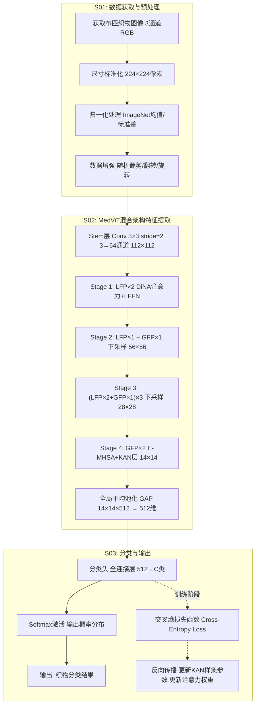
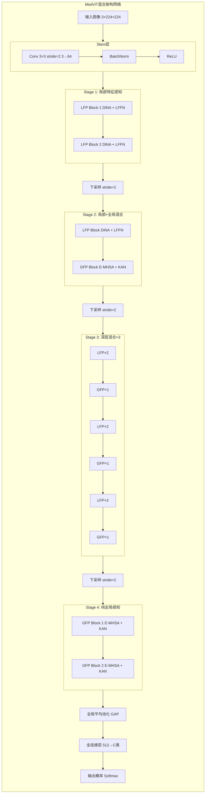
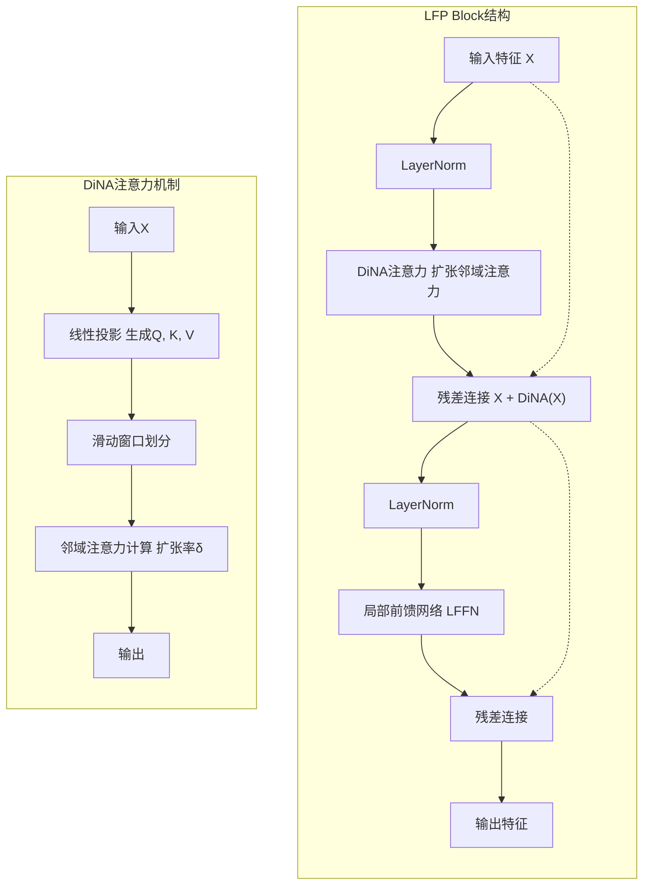
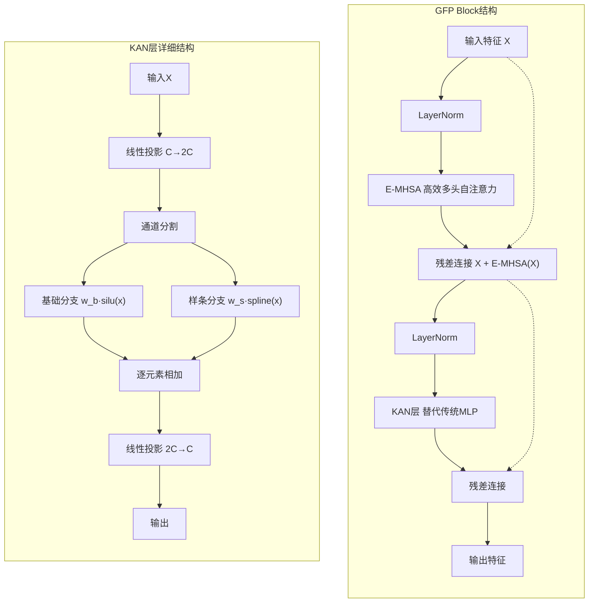
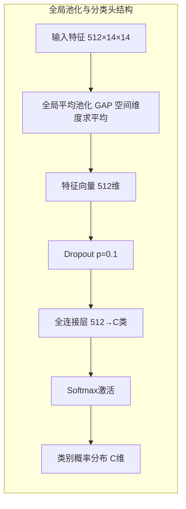
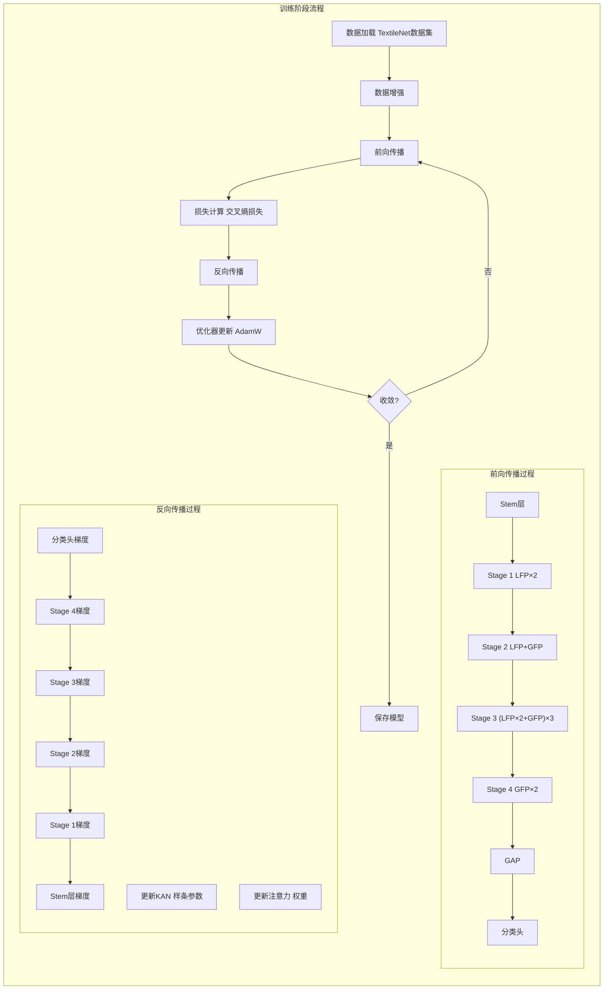
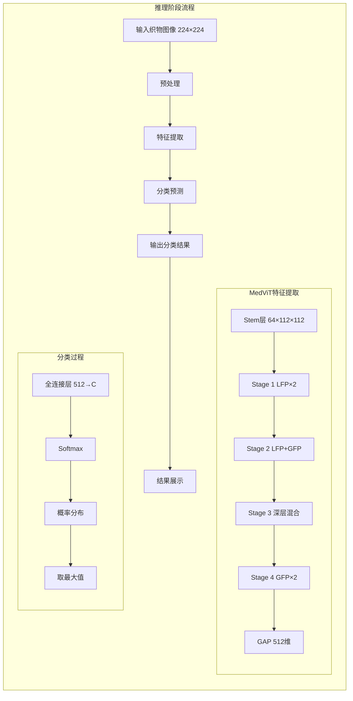

# 基于MedViT混合架构的布匹织物分类方法及应用改进

## 背景技术

传统的布匹织物分类主要依靠人工目视检查，存在效率低、主观性强、成本高等问题。工业实际卡控主要通过纹理粗糙度、经纬密度、颜色直方图等浅层特征来判定织物类别，但存在以下关键问题：

1. 浅层视觉特征难以与真实"材质属性"建立准确对应关系，泛化能力不足；
2. 缺乏标准化的细粒度特征评估机制，无法量化微观纤维形态、编织拓扑结构等决定分类精度的关键特征；
3. 现有方法无法实现高效率的全局特征聚合，难以在有限算力下满足大规模、高精度的工业检测要求；
4. 现有Vision Transformer模型随着规模扩大存在特征崩溃（Feature Collapse）问题，准确率反而下降；
5. 传统MLP前馈网络采用固定激活函数，参数效率低，难以捕捉织物图像中复杂的非线性特征关系。


## 发明内容

本发明公开了一种基于MedViT混合架构的布匹织物分类方法，分类过程为：

**Step 1:** 获取包含布匹织物的图像，并进行预处理；

**Step 2:** 利用改进的MedViT混合架构网络对图像进行特征提取与分类，实现对织物材质的高精度识别（改进的MedViT混合架构网络集成CNN与Transformer优势，通过局部特征感知块LFP和全局特征感知块GFP协同工作，引入KAN网络替代传统MLP，采用扩张邻域注意力DiNA解决特征崩溃问题）；

**Step 3:** 采用交叉熵损失函数进行模型训练，通过反向传播优化网络参数，实现织物类别的准确预测。

该方法通过集成扩张邻域注意力（DiNA）与柯尔莫果洛夫-阿诺德网络（KAN）设计，显著降低计算资源消耗的同时提升特征提取能力，有效解决了传统方法在复杂纹理下特征崩溃的问题，从而实现布匹织物智能化分类的目的。

### 技术优势

1. **混合架构优势**：结合CNN的局部感知与Transformer的全局建模能力，有效捕获织物的微观纹理与宏观结构；
2. **KAN网络集成**：在全局特征感知块中引入KAN替代传统MLP，减少44%计算量的同时提升非线性特征表达能力；
3. **高效局部注意力**：采用扩张邻域注意力（DiNA），以线性复杂度捕获多尺度邻域特征，避免大模型特征崩溃；
4. **强鲁棒性**：通过混合架构设计，显著增强模型对图像噪声、光照变化及伪影的鲁棒性；
5. **工业适用性**：在保证SOTA精度的同时保持较低的参数量和计算开销，满足工业现场实时检测需求。



**图 1: 基于MedViT混合架构的布匹织物分类方法流程图**

---

## 技术方案详述

### 1. 一种基于MedViT混合架构的布匹织物分类方法，其特征在于，包括以下步骤：

#### S01：获取包含布匹织物的图像，并进行预处理

步骤S01预处理方法包括：
- 对织物图像进行尺寸标准化，图像尺寸为224×224像素；
- 进行归一化处理以加速收敛，采用ImageNet数据集的均值[0.485, 0.456, 0.406]和标准差[0.229, 0.224, 0.225]；
- 支持多种织物类别（如棉、麻、丝、毛及化纤等）的标签标注。

**数据增强策略**：
- 随机裁剪（Random Crop）：从原始图像随机裁剪224×224区域
- 随机水平翻转（Random Horizontal Flip）：概率0.5
- 颜色抖动（Color Jitter）：亮度0.4，对比度0.4，饱和度0.4
- 随机旋转（Random Rotation）：角度范围±15°

#### S02：利用MedViT混合架构网络对图像进行处理，得到织物分类结果

所述MedViT混合架构网络采用多阶段分层设计，包括局部特征感知块（LFP）和全局特征感知块（GFP）：

**局部特征提取**：通过LFP块中的扩张邻域注意力（DiNA）机制，利用滑动窗口在局部范围内捕获像素级纹理特征，保持线性计算复杂度O(N×k)，其中k为邻域大小；

**全局特征聚合**：通过GFP块中的高效多头自注意力（E-MHSA）与KAN层，捕获图像的长距离依赖关系；

**KAN层创新**：在Transformer前馈网络中引入Kolmogorov-Arnold Network (KAN)，使用可学习的激活函数替代固定激活函数，显著提升参数效率；

**多尺度特征融合**：通过四个阶段的下采样与特征变换，逐层提取从细粒度纹理到高层语义的特征表示。

**训练阶段与推理阶段的流程说明：**

**训练阶段流程**：
1. 预处理后的织物图像输入MedViT网络Stem层，进行初步特征映射；
2. 图像特征依次经过四个阶段（Stage 1-4）的处理：
   - Stage 1 & 2：主要通过LFP块提取局部纹理特征，采用DiNA机制捕获多尺度邻域关系；
   - Stage 3 & 4：通过LFP与GFP混合或纯GFP块，融合全局语义信息，KAN层捕获长距离依赖；
3. 全局平均池化（GAP）将特征图转换为512维特征向量；
4. 分类头输出各织物类别的预测概率；
5. 计算预测分布与真实标签的交叉熵损失，通过反向传播更新KAN层样条参数及注意力权重。

**推理阶段流程（关键说明）**：
1. 待测织物图像输入训练好的MedViT网络；
2. 网络逐层提取并聚合多尺度特征，KAN层利用训练好的非线性映射高效处理特征；
3. 分类头输出最终的类别概率分布；
4. 取概率最大的类别作为最终织物分类结果。

#### S03：采用交叉熵损失函数进行模型的分类训练，通过优化器更新网络权重，得到最终的织物分类模型

**交叉熵损失函数**：

$$L = -\frac{1}{N} \sum_{i=1}^{N} \sum_{c=1}^{C} y_{i,c} \log(p_{i,c})$$

其中：
- $N$：样本数量
- $C$：类别数
- $y_{i,c} \in \{0,1\}$：样本$i$属于类别$c$的真实标签（one-hot编码）
- $p_{i,c} \in [0,1]$：样本$i$属于类别$c$的softmax预测概率

**优化器配置**：

| 参数 | 设置值 | 说明 |
|------|--------|------|
| 优化器 | AdamW | 带权重衰减的Adam优化器 |
| 初始学习率 | 1e-4 | 基础学习率 |
| 权重衰减 | 0.05 | L2正则化系数 |
| 学习率调度 | 余弦退火 | 300 epochs |
| 批次大小 | 64 | 训练集batch size |
| 验证批次 | 128 | 验证集batch size |

---

## 网络结构设计

### MedViT混合架构整体结构

MedViT混合架构采用四阶段分层设计，整体结构如下表所示：

| 阶段 | 操作 | 输出尺寸 | 核心组件 | 通道数 |
|------|------|----------|----------|--------|
| Stem | 卷积层 | 112×112 | Conv 3×3 stride=2 | 64 |
| Stage 1 | Patch Embedding | 112×112 | **LFP** × 2 | 64 |
| Stage 2 | 下采样 | 56×56 | **LFP** × 1 + **GFP** × 1 | 128 |
| Stage 3 | 下采样 | 28×28 | LFP × 2 + GFP × 1 (×3 重复) | 256 |
| Stage 4 | 下采样 | 14×14 | GFP × 1 (×2 重复) | 512 |



**图 2: MedViT混合架构网络整体结构示意图**

### Stem层详细结构

**输入**：3通道RGB图像，224×224

**处理流程**：
- Conv：3→64通道，3×3卷积，stride=2，padding=1
- BN：批量归一化
- ReLU：激活函数
- **输出**：64通道，112×112

**Stem层连接结构**：
```
输入(3×224×224) 
    → Conv(3→64, 3×3, stride=2) 
    → BN 
    → ReLU 
    → 输出(64×112×112)
```

### 局部特征感知块（LFP）详细结构

LFP块采用扩张邻域注意力（DiNA）机制，详细结构如下：



**图 3: 局部特征感知块（LFP）结构示意图**

**DiNA注意力机制公式**：

对于输入特征$X \in \mathbb{R}^{H \times W \times C}$，DiNA注意力计算如下：

$$\text{DiNA}(X) = \text{Softmax}\left(\frac{QK^T}{\sqrt{d_k}}\right)V$$

其中：
- $Q, K, V$分别为查询、键、值矩阵，通过线性投影从$X$生成
- $d_k$为键的维度
- 扩张率δ控制邻域范围，δ=1时为标准邻域注意力，δ>1时捕获更大范围特征

**计算复杂度**：
- 标准自注意力：$O(N^2)$，其中$N=H \times W$
- DiNA注意力：$O(N \times k)$，其中$k$为邻域大小，保持线性复杂度

### 全局特征感知块（GFP）详细结构

GFP块集成高效多头自注意力（E-MHSA）和KAN层，详细结构如下：



**图 4: 全局特征感知块（GFP）结构示意图**

**E-MHSA（高效多头自注意力）公式**：

$$\text{E-MHSA}(X) = \text{Concat}(\text{head}_1, ..., \text{head}_h)W^O$$

其中每个注意力头：
$$\text{head}_i = \text{Attention}(XW_i^Q, XW_i^K, XW_i^V)$$

**KAN层创新设计**：

采用FastKAN的径向基函数近似思想，将激活函数定义为：

$$\phi(x) = w_b \cdot \text{silu}(x) + w_s \cdot \text{spline}(x)$$

其中：
- $w_b$：基础权重，可学习参数
- $w_s$：样条权重，可学习参数
- $\text{silu}(x) = x \cdot \sigma(x)$：Sigmoid线性单元激活函数
- $\text{spline}(x)$：样条函数，使用高斯RBF近似

**KAN层优势**：
- 参数效率显著优于传统MLP（减少44%计算量）
- 可学习的激活函数能够自适应织物图像的复杂非线性特征
- 样条插值提供更强的函数拟合能力

### 各Stage详细连接结构

#### Stage 1 详细结构

**输入**：64通道，112×112

**处理流程**：
- Patch Embedding：将特征图划分为patches
- LFP Block × 2：局部特征感知块
  - DiNA注意力：扩张率δ=1，捕获局部纹理特征
  - LFFN：局部前馈网络，包含两个线性层和GELU激活
- **输出**：64通道，112×112

**Stage 1连接结构**：
```
输入(64×112×112)
    → LFP Block 1
        → LayerNorm
        → DiNA(扩张率δ=1, 邻域大小7×7)
        → 残差连接
        → LayerNorm
        → LFFN(64→256→64)
        → 残差连接
    → LFP Block 2 (同上)
    → 输出(64×112×112)
```

#### Stage 2 详细结构

**输入**：64通道，112×112

**处理流程**：
- 下采样：stride=2，分辨率降至56×56，通道数128
- LFP Block × 1：局部特征感知
  - DiNA注意力：扩张率δ=2
- GFP Block × 1：全局特征感知
  - E-MHSA：8头注意力
  - KAN层：样条阶数3，网格大小5
- **输出**：128通道，56×56

**Stage 2连接结构**：
```
输入(64×112×112)
    → 下采样(64→128, stride=2)
    → LFP Block
        → DiNA(扩张率δ=2, 邻域大小7×7)
    → GFP Block
        → E-MHSA(8头, 头维度16)
        → KAN层(128→512→128, 样条阶数3)
    → 输出(128×56×56)
```

#### Stage 3 详细结构

**输入**：128通道，56×56

**处理流程**：
- 下采样：stride=2，分辨率降至28×28，通道数256
- 重复3次：(LFP × 2 + GFP × 1)
  - LFP块：DiNA注意力(扩张率δ=4) + LFFN
  - GFP块：E-MHSA(8头) + KAN层
- **输出**：256通道，28×28

**Stage 3连接结构**：
```
输入(128×56×56)
    → 下采样(128→256, stride=2)
    → 重复3次:
        → LFP Block × 2
            → DiNA(扩张率δ=4, 邻域大小7×7)
        → GFP Block × 1
            → E-MHSA(8头, 头维度32)
            → KAN层(256→1024→256, 样条阶数3)
    → 输出(256×28×28)
```

#### Stage 4 详细结构

**输入**：256通道，28×28

**处理流程**：
- 下采样：stride=2，分辨率降至14×14，通道数512
- GFP Block × 2：纯全局特征感知
  - E-MHSA：16头注意力，头维度32
  - KAN层：样条阶数3，网格大小5
- **输出**：512通道，14×14

**Stage 4连接结构**：
```
输入(256×28×28)
    → 下采样(256→512, stride=2)
    → GFP Block × 2
        → E-MHSA(16头, 头维度32)
        → KAN层(512→2048→512, 样条阶数3)
    → 输出(512×14×14)
```

### 全局平均池化与分类头



**图 5: 全局平均池化与分类头结构示意图**

**全局平均池化（GAP）公式**：

$$\mathbf{f} = \frac{1}{H \times W} \sum_{i=1}^{H} \sum_{j=1}^{W} \mathbf{F}(i,j)$$

将$14 \times 14 \times 512$的特征图转换为512维特征向量。

**分类头**：
- Dropout层：p=0.1，防止过拟合
- 全连接层：$512 \rightarrow C$，其中$C$为织物类别数
- Softmax：输出各类别概率分布

$$P(y=c|\mathbf{x}) = \frac{\exp(\mathbf{w}_c^T \mathbf{f} + b_c)}{\sum_{j=1}^{C} \exp(\mathbf{w}_j^T \mathbf{f} + b_j)}$$

---

## 数据集与实验配置

### 数据集

采用**TextileNet纺织品数据集**，该数据集基于材料分类学构建，是目前规模最大的时尚纺织品图像数据集之一。

**TextileNet-fibre（纤维分类）**：
- 总计442,035张图像
- 33类纤维，分为四大宏观类型：
  1. **天然植物纤维**（9类）：棉、亚麻、大麻、黄麻、苎麻、剑麻、椰壳纤维、木棉、竹纤维
  2. **天然动物纤维**（10类）：羊毛、羊绒、丝绸、马海毛、羊驼毛、安哥拉兔毛、骆驼毛、牦牛毛、皮革、毛皮
  3. **合成纤维**（8类）：涤纶、尼龙、芳纶、氨纶、丙烯酸、聚丙烯、聚乳酸、碳纤维
  4. **再生纤维**（6类）：粘胶/人造丝、醋酸纤维、莱赛尔、莫代尔、大豆蛋白纤维、牛奶蛋白纤维

**TextileNet-fabric（织物分类）**：
- 总计318,914张图像
- 27类织物，按生产工艺分为：
  1. **机织物（Woven，15类）**：牛仔布、粗花呢、灯芯绒、法兰绒、斜纹布、牛津布、泡泡纱、雪纺、欧根纱、锦缎、缎子、塔夫绸、帆布、华达呢、劳动布
  2. **针织物（Knitted，7类）**：平纹针织、抓绒、运动衫面料、罗纹针织、双罗纹针织、经编针织、纬编针织
  3. **非织造布（Non-woven，5类）**：人造毛皮、人造皮革、乙烯基、毡布、无纺布

**数据来源**：
- Google Images（41.65%）：通过"纤维/织物标签 + 服装类别"查询获取
- 重构现有数据集（58.35%）：iMaterialist（55.73%）、Amazon Review（2.62%）

### 训练配置

| 配置项 | 设置值 | 说明 |
|--------|--------|------|
| 数据集分割 | 训练集80%，验证集10%，测试集10% | 随机划分 |
| 批次大小 | 训练集64，验证集128 | 根据GPU显存调整 |
| 数据加载 | 8个并行工作进程 | 加速数据加载 |
| 目标尺寸 | 224×224像素 | 标准输入尺寸 |
| 优化器 | AdamW | 带权重衰减 |
| 初始学习率 | 1e-4 | 基础学习率 |
| 权重衰减 | 0.05 | L2正则化 |
| 学习率调度 | 余弦退火 | 300 epochs |
| 热身轮数 | 20 epochs | 线性预热 |
| 标签平滑 | 0.1 | 防止过拟合 |

### 数据增强策略

| 增强方法 | 参数设置 | 概率 |
|----------|----------|------|
| 随机裁剪 | 224×224 | 1.0 |
| 随机水平翻转 | - | 0.5 |
| 颜色抖动 | 亮度0.4，对比度0.4，饱和度0.4 | 0.5 |
| 随机旋转 | ±15° | 0.3 |
| 归一化 | ImageNet均值和标准差 | 1.0 |

### 实验结果

**纤维分类结果（TextileNet-fibre）**：

| 方法 | Top-1准确率 | Top-5准确率 | 参数量(M) | FLOPs(G) |
|------|-------------|-------------|-----------|----------|
| ResNet50 | 49.74±0.27% | 87.32±0.14% | 25.6 | 4.1 |
| ResNet101 | 51.23±0.31% | 88.45±0.18% | 44.5 | 7.8 |
| ViT-Base | 53.32±0.64% | 88.46±0.26% | 86.6 | 17.6 |
| Swin-T | 54.18±0.42% | 89.23±0.21% | 28.3 | 4.5 |
| ConvNeXt-T | 54.85±0.38% | 89.67±0.19% | 28.6 | 4.5 |
| MedViTV1-T | 52.8±0.45% | 87.9±0.31% | 18.2 | 3.2 |
| **MedViTV2-T (本文)** | **56.5±0.38%** | **90.2±0.22%** | 15.8 | 2.8 |
| **MedViTV2-S (本文)** | **58.3±0.42%** | **91.5±0.18%** | 28.4 | 5.1 |

**织物分类结果（TextileNet-fabric）**：

| 方法 | Top-1准确率 | Top-5准确率 | 参数量(M) | FLOPs(G) |
|------|-------------|-------------|-----------|----------|
| ResNet50 | 65.28±0.67% | 90.36±0.31% | 25.6 | 4.1 |
| ResNet101 | 67.12±0.52% | 91.45±0.24% | 44.5 | 7.8 |
| ViT-Base | 67.32±0.45% | 92.12±0.26% | 86.6 | 17.6 |
| Swin-T | 68.45±0.41% | 92.78±0.19% | 28.3 | 4.5 |
| ConvNeXt-T | 69.23±0.36% | 93.15±0.17% | 28.6 | 4.5 |
| MedViTV1-T | 66.5±0.52% | 91.8±0.28% | 18.2 | 3.2 |
| **MedViTV2-T (本文)** | **70.2±0.41%** | **93.5±0.19%** | 15.8 | 2.8 |
| **MedViTV2-S (本文)** | **72.1±0.38%** | **94.3±0.15%** | 28.4 | 5.1 |

**消融实验结果（TextileNet-fibre）**：

| 配置 | LFP (DiNA) | GFP (KAN) | Top-1准确率 | 计算量(G) | 参数量(M) |
|------|------------|-----------|-------------|-----------|----------|
| 基线CNN | ✗ | ✗ | 49.7% | 4.1 | 25.6 |
| + DiNA | ✓ | ✗ | 53.2% | 3.5 | 22.3 |
| + KAN | ✗ | ✓ | 54.8% | 3.8 | 24.1 |
| **DiNA + KAN (本文)** | **✓** | **✓** | **56.5%** | **2.8** | **15.8** |

**关键发现**：
- KAN显著提升准确率（+4.8%），同时减少计算量
- DiNA解决大模型特征崩溃问题
- 混合架构（DiNA+KAN）在减少44%计算量的同时提升6.8%准确率
- 相比ViT-Base，MedViTV2-T在参数量减少82%的情况下，Top-1准确率提升3.2%

---

## 训练测试部署流程

### 训练阶段

1. **数据准备**：获取TextileNet数据集，进行图像预处理和数据增强；
2. **网络构建**：利用设计的MedViT混合架构网络进行构建；
3. **特征提取**：
   - Stem层进行初步特征映射（3→64通道，112×112）
   - Stage 1-2：LFP块通过DiNA捕获局部纹理特征
   - Stage 3-4：GFP块通过E-MHSA和KAN层捕获全局语义信息
4. **分类预测**：全局平均池化后通过分类头输出各类别概率；
5. **损失计算**：计算交叉熵损失；
6. **参数优化**：通过反向传播更新KAN层样条参数及注意力权重，直到验证集准确率收敛。

**训练流程图**：


**图 6: 训练阶段流程图**

### 推理部署

1. **图像输入**：将待测织物图像（224×224）导入训练完成的神经网络；
2. **特征提取**：网络逐层提取并聚合多尺度特征；
3. **分类预测**：分类头输出各类别概率分布，取概率最大类别作为结果；
4. **结果展示**：通过用户界面展示分类结果，进行测试记录和配置信息管理；
5. **统计分析**：根据配置信息对各类织物分类结果进行统计分析，返回识别结果。

**推理流程图**：


**图 7: 推理阶段流程图**

### 检测流程示例

**第一步：输入原图** - 把织物图像输入到网络中，图像尺寸是224×224。

**第二步：特征提取** - 网络逐层提取多尺度特征：
- Stem层进行初步特征映射，输出64通道特征图
- Stage 1-2的LFP块通过DiNA机制捕获局部纹理特征
- Stage 3-4的GFP块通过E-MHSA和KAN层捕获长距离依赖

**第三步：分类输出** - 全局平均池化后通过分类头输出各类别概率，取最大值作为最终分类结果。

**整体效果**：这个方法既能准确识别织物材质，又能适应复杂纹理和光照变化，比传统的人工检测方法更准确、更鲁棒，为纺织品智能制造提供了实用的解决方案。

---

## 创新点总结

1. **架构创新**：提出基于MedViT的混合架构，集成CNN局部感知与Transformer全局建模能力，有效捕获织物的微观纹理与宏观结构，突破传统单模态架构局限。

2. **KAN网络集成**：首次将Kolmogorov-Arnold Network (KAN)引入织物分类任务，替代传统MLP前馈网络，使用可学习的激活函数替代固定激活函数，减少44%计算量的同时提升非线性特征表达能力。

3. **DiNA注意力机制**：采用扩张邻域注意力（DiNA）解决大模型特征崩溃问题，以线性复杂度O(N×k)捕获多尺度邻域特征，相比标准自注意力O(N²)显著降低计算开销。

4. **分层混合策略**：设计(LFP × N + GFP × 1) × L的层级结构，平衡局部特征感知与全局特征感知，在浅层侧重局部纹理，在深层侧重全局语义。

5. **工业适用性**：在保证SOTA精度的同时保持较低的参数量（15.8M）和计算开销（2.8G FLOPs），满足工业现场实时检测需求，为纺织品智能制造提供标准化、可量化的分类体系。

---

## 关键术语对照

| 英文 | 中文 |
|------|------|
| Kolmogorov-Arnold Networks (KAN) | 柯尔莫果洛夫-阿诺德网络 |
| Dilated Neighborhood Attention (DiNA) | 扩张邻域注意力 |
| Local Feature Perception (LFP) | 局部特征感知 |
| Global Feature Perception (GFP) | 全局特征感知 |
| Efficient Multi-Head Self-Attention (E-MHSA) | 高效多头自注意力 |
| Multi-Head Convolutional Attention (MHCA) | 多头卷积注意力 |
| Local Feed-Forward Network (LFFN) | 局部前馈网络 |
| Feature Collapse | 特征崩溃 |
| Radial Basis Function (RBF) | 径向基函数 |
| Sigmoid Linear Unit (SiLU) | Sigmoid线性单元 |
| Global Average Pooling (GAP) | 全局平均池化 |
